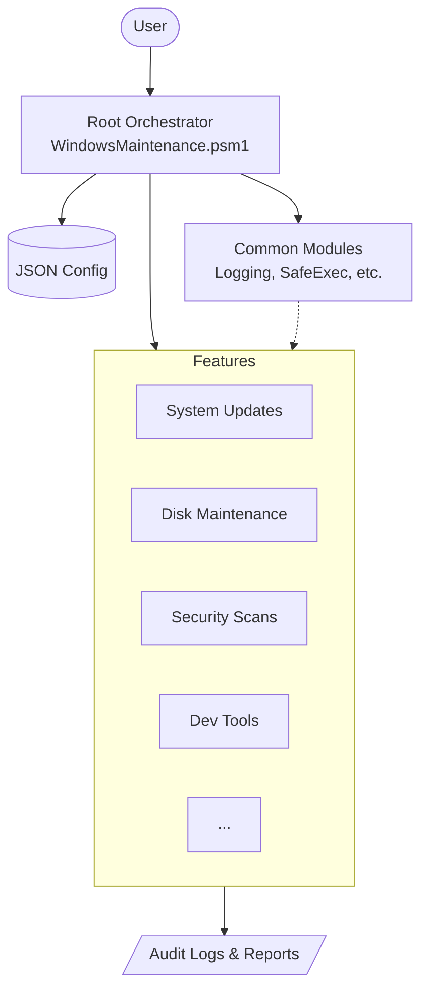

# Windows Maintenance Framework

**Enterprise-Grade Windows System Maintenance and Optimization**

[](https://codeexplorer430.github.io/windows-maintenance-script/)
[](LICENSE)
[](https://microsoft.com/powershell)

Version 4.2.0 | February 2026 | [Official Documentation](https://codeexplorer430.github.io/windows-maintenance-script/)

---

## ⚡ One-Liner Installation

Run the following command in an **Administrator PowerShell** terminal to download and install the latest version automatically:

```powershell
iex (irm https://raw.githubusercontent.com/CodeExplorer430/windows-maintenance-script/main/Bootstrap.ps1)
```

---

## Overview

The Windows Maintenance Framework provides comprehensive, automated system maintenance for Windows 10/11 workstations and developer environments. It is a modernized, modular PowerShell solution designed for high performance, safety, and reliability.



### Key Features

- **Cross-Version Support** - Fully compatible with PowerShell 5.1 (Desktop) and PowerShell 7.4+ (Core).
- **Parallel Processing** - Leverages multi-threading in PowerShell 7 for significantly faster disk and security operations.
- **Modular Architecture** - Decoupled, parameter-driven design using dependency injection.
- **Zero-Warning Code Quality** - 100% PSScriptAnalyzer cleanliness across the entire active codebase.
- **Environment-Aware Testing** - Comprehensive Pester 5.x test suite that gracefully handles non-elevated environments.
- **Stream-Based Logging** - Modern `Write-Information` logging with metadata tags for rich CLI and GUI integration.
- **Task Scheduling** - Built-in Windows Task Scheduler integration for automated maintenance.
- **Safe Execution** - Full `-WhatIf` and `-Confirm` support, timeouts, and intelligent error recovery.

---

## Quick Start

### Prerequisites

- Windows 10 (1809+) or Windows 11
- PowerShell 5.1 or PowerShell 7.4+
- Administrator privileges (for system-level changes)

### Installation

1. **Clone or download this repository**
   ```powershell
   git clone <repository-url>
   cd windows-maintenance-script
   ```

2. **Review settings**
   ```powershell
   notepad Config\maintenance-config.json
   ```

3. **Verify environment (recommended)**
   ```powershell
   # Run in WhatIf mode to see what would happen
   Import-Module .\WindowsMaintenance.psd1
   Invoke-WindowsMaintenance -WhatIf
   ```

4. **Execute maintenance**
   ```powershell
   # Run as Administrator (use 'pwsh' for best performance)
   pwsh .\Run-Maintenance.ps1
   ```

5. **Optional TUI (PowerShell 7+)**
   ```powershell
   pwsh .\Run-Maintenance.ps1 -Interactive
   ```

### Scheduled Maintenance

Set up automatic weekly maintenance:

```powershell
# Install scheduled task (requires Administrator)
.\Tools\Install-MaintenanceTask.ps1 -TaskName "WeeklyMaintenance"
```

---

## Architecture

The framework is organized into modular components:

```
windows-maintenance-script/
├── WindowsMaintenance.psm1      # Root orchestrator module
├── WindowsMaintenance.psd1      # Module manifest (Core & Desktop compatible)
├── Run-Maintenance.ps1          # Unified standalone launcher
├── Config/
│   └── maintenance-config.json  # Main configuration
├── Modules/
│   ├── Common/                  # Shared utilities (Logging, SafeExecution, etc.)
│   ├── SystemUpdates.psm1       # Windows Update management
│   ├── DiskMaintenance.psm1     # Parallel disk cleanup & optimization
│   ├── SystemHealthRepair.psm1  # DISM/SFC repairs
│   ├── SecurityScans.psm1       # Windows Defender scans
│   ├── DeveloperMaintenance.psm1 # Development tool cleanups
│   ├── PerformanceOptimization.psm1 # Performance tuning
│   ├── ...                      # Other feature modules
├── Tools/                       # Utility scripts (Installer, GUI, Signer)
├── Tests/                       # Pester 5.x Unit and Integration tests
└── Legacy/                      # ⚠️ DEPRECATED scripts
```

---

## Performance (PowerShell 7.4 vs 5.1)

While fully compatible with PowerShell 5.1, the framework is optimized for PowerShell 7.4+:

| Feature | PowerShell 5.1 | PowerShell 7.4+ |
|---------|----------------|-----------------|
| **Execution** | Sequential | **Parallel (Multi-threaded)** |
| **Engine** | .NET Framework | **.NET 8.0** |
| **IO Speed** | Standard | **Optimized** |
| **Disk Ops** | One-by-one | **Simultaneous Drive Processing** |

---

## Configuration

The framework uses JSON-based configuration located at:
`Config/maintenance-config.json`

Detailed configuration documentation is available in **[CONFIG.md](CONFIG.md)**.

---

## Testing

The framework includes a modern, resilient Pester 5.7.1+ test suite.

```powershell
# Run all tests (Environment-aware: skips admin tests if not elevated)
# Utilizes Show-TestResult for colorized output and handles Pester 5 discovery phases.
.\Tests\Invoke-Tests.ps1
```

For testing documentation, see: **[testing-plan.md](testing-plan.md)**

---

## Documentation

| Document | Description |
|----------|-------------|
| [Docs/config.md](docs/config.md) | Complete configuration reference |
| [Docs/architecture.md](docs/architecture.md) | System design and dependency injection |
| [Docs/user-guide.md](docs/user-guide.md) | Detailed usage and troubleshooting |
| [Docs/module-development.md](docs/module-development.md) | Guide for creating new modules |

---

## Requirements

### System Requirements
- Windows 10 version 1809 or later
- Windows 11 (all versions)
- PowerShell 5.1 or PowerShell 7.4+
- Administrator privileges for system operations

### Optional Requirements
- **Pester 5.7.1+** - Strictly required for the modern test suite
- **Git** - For development tool features
- **PowerShell 7.4** - Recommended for parallel performance
- **SQLite Runtime** - For high-performance database persistent logging (modularized)

---

## Security

The framework implements security best practices:
- ✅ **CIM-Based** - Replaced legacy WMI with modern, secure CIM queries.
- ✅ **Validation** - Input sanitization and parameter-driven architecture.
- ✅ **Audit Trails** - Detailed, structured logging for all operations.
- ✅ **Simulation** - Full `-WhatIf` support prevents accidental changes.
- ✅ **Signed** - Ready for code signing in secure environments.

---

## Community

- **Contributing**: Please read our **[CONTRIBUTING.md](CONTRIBUTING.md)** for details on our code of conduct and the process for submitting pull requests.
- **Code of Conduct**: This project adheres to the **[Contributor Covenant](CODE_OF_CONDUCT.md)**.
- **Security**: For reporting vulnerabilities, please see our **[Security Policy](SECURITY.md)**.

## License

MIT License - See **[LICENSE](LICENSE)** file for details

---

- **Last Updated:** February 2026
- **Version:** 4.2.0
- **Author:** Miguel Velasco
- **PowerShell Version:** 5.1 / 7.4+
- **Platform:** Windows 10/11
