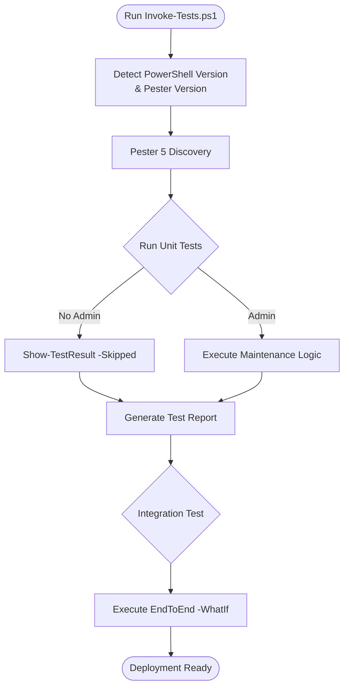

# Windows Maintenance Framework - Comprehensive Testing Plan

**Version:** 4.2.0
**Date:** February 2026
**Purpose:** Complete testing checklist for framework validation across PowerShell 5.1 and 7.4+.

---

## Testing Overview

This document provides a comprehensive testing plan to validate all components of the Windows Maintenance Framework. The framework uses a modernized, environment-aware testing strategy.

### Testing Strategy



1.  **Unit Testing**: Individual module functionality using Pester 5.7.1+.
2.  **Cross-Version Testing**: Validation on both PowerShell 5.1 (Desktop) and PowerShell 7.4+ (Core).
3.  **Environment-Awareness**: Graceful skipping of admin-required tests in non-elevated terminals via `Show-TestResult`.
4.  **Integration Testing**: End-to-end execution in `-WhatIf` mode.
5.  **Simulation Validation**: Verifying that `-WhatIf` and `-Confirm` prevent system state changes.

---

## Phase 1: Test Environment Setup

### 1.1 Prerequisites
- **Pester 5.7.1+**: `Install-Module -Name Pester -Force -Scope CurrentUser` (Strictly required for modern discovery)
- **PowerShell 7.4**: Recommended for testing parallel features.
- **PowerShell 5.1**: Required for backward compatibility testing.

### 1.2 Automated Runner
The primary entry point for all tests is `Tests/Invoke-Tests.ps1`. This script automatically detects the environment and ensures Pester 5.7.1+ is utilized.

```powershell
# Run all tests
.\Tests\Invoke-Tests.ps1
```

---

## Phase 2: Unit Testing (Pester 5.7.1+)

### 2.1 Common Infrastructure
Test the foundational modules in `Modules/Common/`.

- **Logging**: Verify `Write-Information` stream output and metadata tags.
- **SafeExecution**: Test `Invoke-Parallel` performance on PS 7 vs fallback on PS 5.1.
- **DriveAnalysis**: Verify CIM-based drive detection and Linux partition skipping.
- **MemoryManagement**: Ensure double-typed return values for metrics.
- **SystemDetection**: Verify OS, memory, and application detection logic.
- **HardwareDiagnostics**: Verify battery and storage health retrieval.
- **Database**: Ensure SQLite integration is fully modularized and exports `Invoke-SQLiteQuery`.

### 2.2 Feature Modules
Test individual maintenance logic in `Modules/`.

- **DiskMaintenance**: Verify parallel drive optimization (PS 7+).
- **SystemUpdates**: Test update detection and component reset logic.
- **SecurityScans**: Validate Windows Defender scan orchestration and job management.
- **PerformanceOptimization**: Test startup item analysis and resource sampling.
- **MultimediaMaintenance**: Verify cache clearing paths for Adobe, Resolve, etc.
- **PrivacyMaintenance**: Verify registry-based hardening logic.
- **BloatwareRemoval**: Verify UWP package filtering and removal logic.

**Expected Results (Non-Admin Terminal):**
- ✅ Non-elevated tests pass.
- 🟡 Admin-required tests are marked as **Skipped** (using `Show-TestResult`).
- ✅ 100% "Clean" report (Zero Red).

---

## Phase 3: Integration Testing

### 3.1 Full Framework Execution (WhatIf Mode)
Validate the orchestrator without changing system state.

```powershell
# Run end-to-end integration test
.\Tests\Invoke-Tests.ps1 -TestPath "Integration\EndToEnd.Tests.ps1"
```

**Success Criteria:**
- Zero errors during full maintenance lifecycle.
- Correct injection of `$Config` parameter to all modules.
- All 17 feature modules processed or skipped according to configuration.
- Database logging confirmed functional during `-WhatIf` run.

---

## Phase 4: PowerShell Version Validation

### 4.1 PowerShell 5.1 (Legacy)
Run `Invoke-Tests.ps1` from a standard Windows PowerShell terminal.
- **Check**: No "ForEach-Object -Parallel" errors.
- **Check**: WMI fallback or CIM compatibility.

### 4.2 PowerShell 7.4 (Modern)
Run `Invoke-Tests.ps1` from a `pwsh` terminal.
- **Check**: Parallel execution speed improvements.
- **Check**: Correct handling of Core-specific automatic variables.

---

## Phase 5: GUI and Tools Testing

### 5.1 GUI Responsiveness
1. Launch `.\Tools\Start-MaintenanceGUI.ps1`.
2. Start a long-running job.
3. **Check**: The UI remains responsive (no "Not Responding" title).
4. **Check**: Real-time output displays in the GUI console.

### 5.2 Tool Quality
Run `PSScriptAnalyzer` on the `Tools/` directory.
- **Check**: Zero warnings for `Write-Host`.
- **Check**: Correct UTF-8 BOM encoding for `Sign-AllScripts.ps1`.

---

## Phase 6: Code Quality Standards

### 6.1 Strict Analyzer Enforcement
The framework maintains a "Zero Warning" policy.

```powershell
# Verify absolute cleanliness
Get-ChildItem -Path . -Recurse -File | 
    Where-Object { $_.FullName -notmatch '[\\/]Legacy[\\/]' } | 
    Invoke-ScriptAnalyzer -Settings ./PSScriptAnalyzerSettings.psd1
```

---

## Test Results Matrix (v4.2.0)

| Environment | Unit Tests | Integration | Simulation (WhatIf) |
|-------------|------------|-------------|-------------------|
| **PS 5.1 (Admin)** | Pass | Pass | Pass |
| **PS 5.1 (User)** | Skip (Admin Only) | Skip | Pass |
| **PS 7.4 (Admin)** | Pass | Pass | Pass |
| **PS 7.4 (User)** | Skip (Admin Only) | Skip | Pass |

---

**Last Updated:** February 2026
**Approved By:** Miguel Velasco
