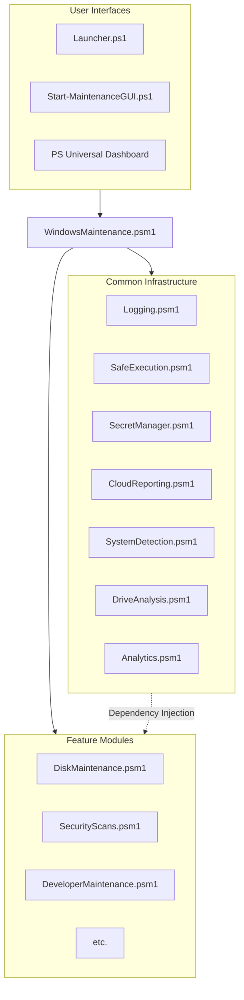
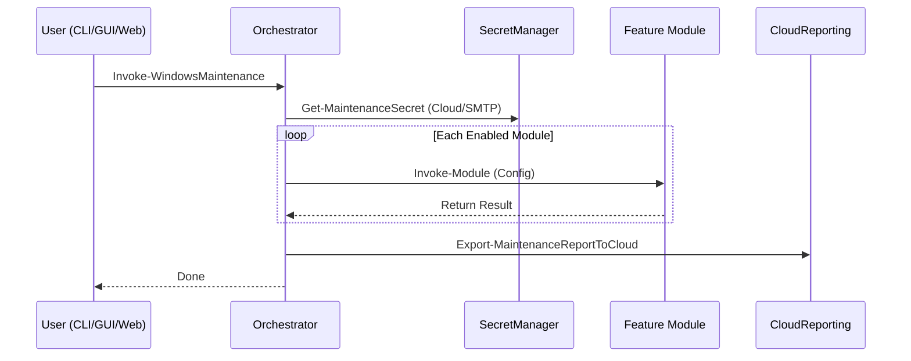

# Windows Maintenance Framework Architecture

## Overview

The Windows Maintenance Framework (v4.2.0) is a modernized, decoupled PowerShell architecture designed for Windows 11 and Windows 10. It utilizes a **Dependency Injection** pattern to ensure modules remain independent, testable, and compatible across PowerShell versions (5.1 and 7.4+).

## Core Architectural Principles

1.  **Decoupling**: No global state. Configuration is passed via a `$Config` hashtable from the root module to sub-modules.
2.  **Security-First**: Integrated **SecretManagement** for sensitive credentials (SMTP, Azure, Database).
3.  **Cross-Edition Compatibility**: Parallel performance on PowerShell 7 (Core) with seamless sequential fallback on PowerShell 5.1 (Desktop).
4.  **Unified Messaging**: Use of PowerShell Streams (`Information` and `Error`) instead of direct host output (`Write-Host`).
5.  **Hardware Abstraction**: Standardized use of **CIM** (`Get-CimInstance`) over legacy WMI.

## Component Hierarchy

## Key Mechanisms

### Secret Management
The `SecretManager.psm1` wrapper abstracts the `Microsoft.PowerShell.SecretManagement` module. It allows the framework to securely retrieve credentials for SMTP alerts and Cloud storage from a local or enterprise vault.

### Invoke-Parallel (SafeExecution)
Detects the host PowerShell version:
- **PS 7.4+**: Uses `ForEach-Object -Parallel` for multi-threaded performance in `DiskMaintenance` and `DeveloperMaintenance`.
- **PS 5.1**: Automatically falls back to standard `foreach` sequential loops.

### Cloud Integration (CloudReporting)
Supports automated report uploads to centralized storage providers (e.g., Azure Blob Storage). This enables fleet-wide observability for IT administrators.

## Execution Flow

