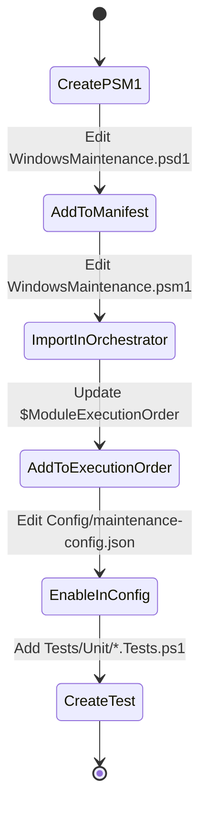

# Module Development Guide (v4.2.0)

## Architectural Standards

All new modules MUST adhere to these standards to ensure compatibility and quality:

1.  **Dependency Injection**: Accept a mandatory `[hashtable]$Config` parameter. NEVER use `$Global:` variables for configuration.
2.  **Safety First**: Use `[CmdletBinding(SupportsShouldProcess=$true)]` and implement `$PSCmdlet.ShouldProcess()` for all state-changing operations.
3.  **Encapsulation**: Use `Invoke-SafeCommand` to wrap logical tasks for automatic error handling and performance tracking.
4.  **Modern Logging**: Use `Write-MaintenanceLog` for all output.
5.  **Strict Typing**: Declare `[OutputType([hashtable])]` (or appropriate type) for all public functions.
6.  **CIM over WMI**: Use `Get-CimInstance` for hardware and system queries.

## Creating a New Module

### 1. Create the Module File
Create a new `.psm1` file in `Modules/`. Use the following template:

```powershell
<#
.SYNOPSIS
    Descriptive name of your module.
#>

# Import dependencies (Infrastructure is usually handled by root, but required for isolated testing)
Import-Module "$PSScriptRoot\Common\Logging.psm1" -Force
Import-Module "$PSScriptRoot\Common\SafeExecution.psm1" -Force

function Invoke-MyNewModule {
    [CmdletBinding(SupportsShouldProcess=$true)]
    [OutputType([hashtable])]
    param(
        [Parameter(Mandatory=$true)]
        [hashtable]$Config
    )

    # Check if enabled
    if ("MyNewModule" -notin $Config.EnabledModules) {
        Write-MaintenanceLog -Message 'MyNewModule module disabled' -Level INFO
        return @{ Success = $true; Skipped = $true }
    }

    Write-MaintenanceLog -Message '======== MyNewModule Module ========' -Level INFO

    # Execute task safely
    $Result = Invoke-SafeCommand -TaskName "Primary Task" -Command {
        # Check for WhatIf
        if ($PSCmdlet.ShouldProcess("System", "Modify something important")) {
            # Implementation logic here
            Write-MaintenanceLog -Message "Operation performed" -Level SUCCESS
            return @{ Success = $true }
        }
        return @{ Success = $true; Simulated = $true }
    }

    return $Result
}

Export-ModuleMember -Function Invoke-MyNewModule
```

### 2. Register the Module
To integrate the module into the framework:



1.  **Manifest**: Add the path to your module in `WindowsMaintenance.psd1` under the `NestedModules` array.
2.  **Orchestrator**: Open `WindowsMaintenance.psm1` and:
    - Add the `Import-Module` call at the top.
    - Add your module to the `$ModuleExecutionOrder` array in the `Invoke-WindowsMaintenance` function.
3.  **Config**: Add your module name to the `EnabledModules` array in `Config/maintenance-config.json` and add a specific configuration section if needed.

## Best Practices

- **Parallelism**: If your module processes a collection (e.g., files or drives), use `Invoke-Parallel` from `SafeExecution.psm1` to support PowerShell 7 multi-threading.
- **Paths**: Use `$Config.ReportsPath` and `$Config.LogsPath` for any file output.
- **Naming**: Use singular nouns for function names (e.g., `Invoke-SecurityScan` NOT `Invoke-SecurityScans`).
- **Tests**: Every new module must include a corresponding test file in `Tests/Unit/` using Pester 5.7.1+.
