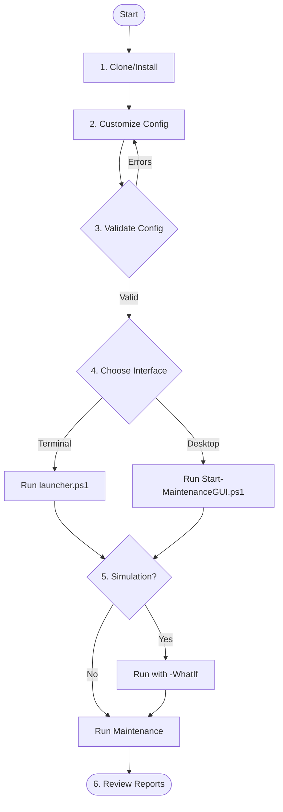

# User Guide (v4.2.0)

## Overview

The Windows Maintenance Framework is a modular system for keeping your Windows 10/11 environment clean, secure, and fast. It supports both PowerShell 5.1 and PowerShell 7.4+.



## Prerequisites

- **Administrator Privileges**: Required for most operations.
- **PowerShell**: Version 5.1 or 7.4+ (Core) is recommended for best performance.
- **Pester 5.7.1+**: Required only for development and running the test suite.
- **Execution Policy**: Must be set to `RemoteSigned` or `Bypass`.

## Running the Maintenance

### CLI Mode (Highest Performance)

Run the script from an **Elevated PowerShell** terminal. If you have PowerShell 7 installed, use `pwsh` for multi-threaded performance.

```powershell
# Using the launcher script
.\Run-Maintenance.ps1

# Or manually importing the module
Import-Module .\WindowsMaintenance.psd1
Invoke-WindowsMaintenance
```

**Common Command Options:**
- `-WhatIf`: **Safety Check.** See exactly what would happen without making any changes.
- `-SilentMode`: Prevents interactive message boxes (Ideal for servers/scheduled tasks).
- `-ConfigPath <path>`: Load a custom JSON settings file.

### GUI Mode (User Friendly)

For a graphical interface, run the GUI launcher:

```powershell
.\Tools\Start-MaintenanceGUI.ps1
```

1.  **Select Modules**: Check the boxes for the maintenance tasks you want to perform.
2.  **Toggle Options**: Enable `WhatIf` for a dry run or `Silent Mode` for non-interactive execution.
3.  **Start**: Click "Start" to begin the maintenance process. The job runs asynchronously, so you can continue to use the GUI.

## Configuration

Settings are managed in `Config/maintenance-config.json`.

- **EnabledModules**: Control which tasks are performed.
- **Paths**: Define where logs and reports are saved.
- **Database**: The system now uses a modularized SQLite database for high-performance metrics and history.
- **Module Specifics**: Adjust thresholds for disk cleanup, security scan levels, and developer tool cleanups.

## Testing and Quality Assurance

The framework includes 51 automated Pester tests to ensure reliability.

```powershell
# Execute the full test suite
.\Tests\Invoke-Tests.ps1
```

The testing system uses `Show-TestResult` for colorized, non-interactive reporting and adheres to strict PSScriptAnalyzer standards for zero-warning code quality.


## Automated Maintenance

To set up a recurring maintenance schedule (e.g., every Sunday at 2:00 AM):

```powershell
# Default weekly installation
.\Tools\Install-MaintenanceTask.ps1 -Interactive
```

This will create a wrapper script in `Scripts/` and register a task in the Windows Task Scheduler.

## Troubleshooting

-   **Permission Denied**: Ensure you launched PowerShell as an Administrator.
-   **Missing Commands**: If `pwsh` is not found, the script automatically falls back to standard PowerShell 5.1.
-   **Validation Errors**: Use `.\Tools\Test-MaintenanceConfig.ps1` to verify your JSON configuration is correct.
-   **Logs**: Audit trails are located in the path defined by `LogsPath` in your config (Default: `$env:TEMP\WindowsMaintenance\Logs`).
